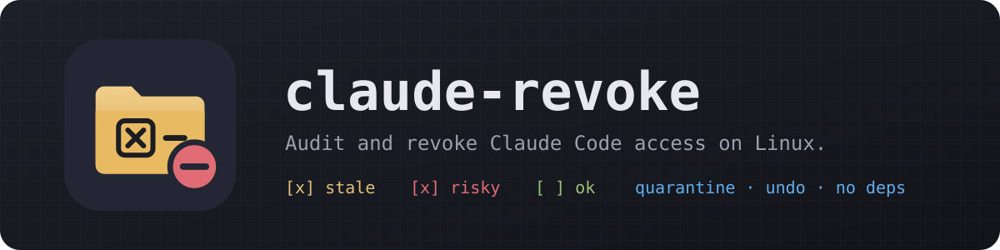
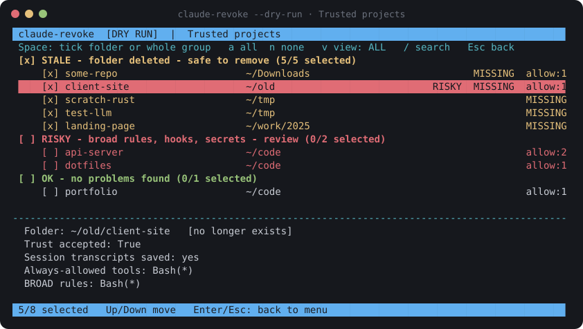
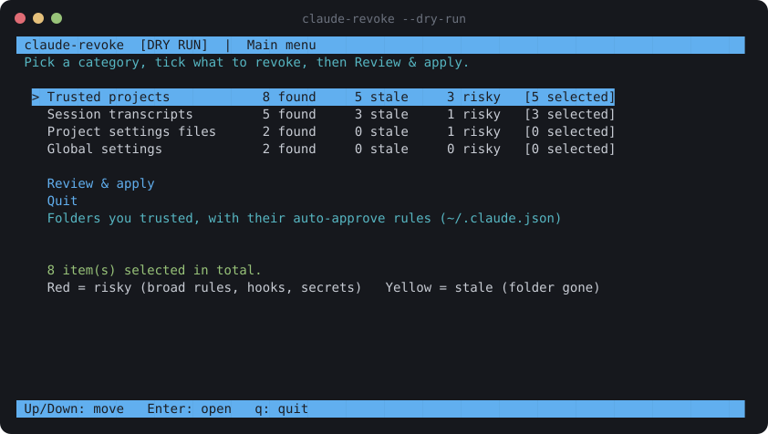

<p align="center">
  
</p>

<p align="center">
  
  
  
  
  
</p>

---

Every time you run Claude Code in a folder and click **"Always allow"**, it remembers. After a year you can have hundreds of trusted folders, auto-approve rules, extra directories and saved transcripts spread across your disk, and no easy way to see them all.

**claude-revoke** is an installer-style terminal UI in reverse. Instead of choosing what to install, you see everything Claude Code has been given, grouped into **STALE**, **RISKY** and **OK**, tick what you want gone, and apply. Nothing is deleted: removed items go to a quarantine folder, and one command undoes a run.

<p align="center">
  
</p>

## Features

- **Full inventory**: trusted folders, "always allow" rules, extra directories, session transcripts, per-project settings files, hooks and MCP servers.
- **Grouped checkboxes**: STALE (folder deleted), RISKY (broad rules such as `Bash(*)`, bypass mode, hooks, leaked secrets) and OK. Tick a whole group or one folder at a time.
- **Secret scan**: finds AWS keys, private keys, GitHub/Slack/API tokens and `KEY=value` lines inside saved transcripts, so you know what to rotate.
- **Hardening**: one tick adds deny rules for `~/.ssh`, `~/.aws`, `.env`, `*.pem` and similar.
- **Safe by design**: dry-run mode, a review screen, typed `YES` confirmation, JSON backups, quarantine instead of delete, and `--restore`.
- **Theme-aware**: draws only with your terminal's own palette, so it matches your rice.
- **Zero dependencies**: a single Python file using the standard library.

<p align="center">
  
</p>

## Install (Pop!_OS / Ubuntu / Debian)

```bash
git clone https://github.com/<you>/claude-revoke.git
cd claude-revoke
./install.sh
```

This installs the `claude-revoke` command into `~/.local/bin` and adds a **Claude Revoke** entry to the COSMIC launcher (Super, then type "revoke"). Remove both with `./uninstall.sh`.

To run it without installing:

```bash
python3 claude_revoke.py --dry-run
```

## Usage

```bash
claude-revoke --report                 # read-only audit, plain text
claude-revoke --report --only stale    # just the leftovers
claude-revoke --dry-run                # full UI, applying changes nothing
claude-revoke                          # the real thing (close Claude Code first)
claude-revoke --restore ~/.claude-revoke-quarantine/<timestamp>
claude-revoke --roots ~/code ~/work    # limit where it searches for project settings
```

### Keys

| Key | Action |
| --- | --- |
| `↑` `↓` / `j` `k` | Move |
| `Enter` | Open a category / go back |
| `Space` | Tick a folder, or a whole group on its header |
| `a` / `n` | Tick / untick everything visible |
| `s` / `r` | Tick all stale / all risky |
| `v` | View: all → stale → risky → selected |
| `/` | Search by folder name |
| `Esc` / `q` | Back / quit |

## Matching your terminal theme

claude-revoke never hard-codes colors. Everything comes from your terminal theme's 16-color palette, and the bars use one palette slot as the accent. Choose which one:

```bash
claude-revoke --accent magenta
claude-revoke --accent bright-cyan
claude-revoke --accent 12               # palette index 0-15
export CLAUDE_REVOKE_ACCENT=yellow      # make it permanent (~/.bashrc)
```

`NO_COLOR=1` gives a monochrome UI.

## What it reads and changes

| Location | What it is | Action |
| --- | --- | --- |
| `~/.claude.json` → `projects` | Trusted folders and their allow rules | Entry removed (file backed up) |
| `~/.claude.json` → `mcpServers` | MCP servers for every project | Entry removed (file backed up) |
| `~/.claude/projects/*` | Session transcripts | Moved to quarantine |
| `<project>/.claude/settings*.json` | Per-project rules and hooks | Moved to quarantine |
| `~/.claude/settings.json` | Global rules, extra dirs, hooks, bypass mode | Entry removed (file backed up) |

Everything removed lands in `~/.claude-revoke-quarantine/<timestamp>/` together with a `manifest.json`. Check that nothing broke, then delete that folder for good.

> [!IMPORTANT]
> Close all Claude Code sessions before applying. A running session can write `~/.claude.json` again and undo your changes. claude-revoke warns you if it detects one.

> [!NOTE]
> Revoking only stops future auto-approval. If the scan finds secrets in transcripts, assume they were sent to the model during that session and **rotate them**.

## Limitations

This cleans up configuration and stored data. It does not sandbox Claude Code, which still runs with your user's permissions. For OS-enforced limits, use Claude Code's sandbox mode, [landrun](https://github.com/Zouuup/landrun), bubblewrap or a container.

Claude Code's file layout can change between versions. Run `--report` first and check it against your machine.

## Roadmap

- [ ] `.deb` package and Pop!_OS install via a PPA
- [ ] Support for other agents (Codex CLI, Gemini CLI, Cursor)
- [ ] Scheduled audits with a desktop notification
- [ ] Native COSMIC (libcosmic) GUI

## License

MIT. See [LICENSE](LICENSE).

claude-revoke is an independent project. It is not affiliated with or endorsed by Anthropic. "Claude" is a trademark of Anthropic.
